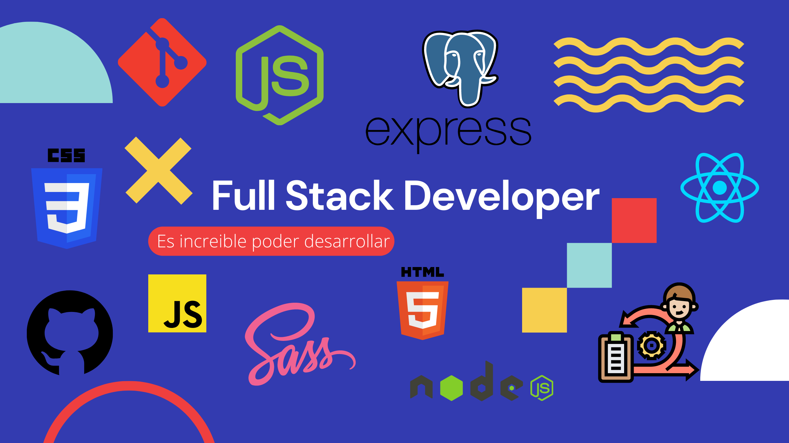

# Hi, I am Elian! 👋

##  About Me
I am a Full Stack Developer, I develop my skills with great skill in both Frontend and Backend, although I am a little more oriented to the Front.

I consider myself a developer with great learning ability and above all with great desire to create, learn, innovate and help in the growth of the company or community.

I have completed my career as a Computer Science Technician, this while I was self-taught in web development technology and then I entered the Henry Bootcamp to strengthen my knowledge and work as a Full Stack Developer.

My work experience has been mainly in the academic field, developing applications with libraries and JavaScript frameworks in Frontend technologies such as Javascript, React and in the Backend Node, Express, PostgreSQL among others.....

Do you want to know me better, then contact me on my networks! 

Thanks for stopping in my Github.

Email: eliancarlogm@gmail.com

## Skills
* HTML
* CSS
* LESS
* Tailwind CSS
* JavaScript
* React
* Astro
* Node
* Express
* Nextjs
* Sequelize
* MongoDb
* PostgreSQL
* Figma

## Links

## Stats

